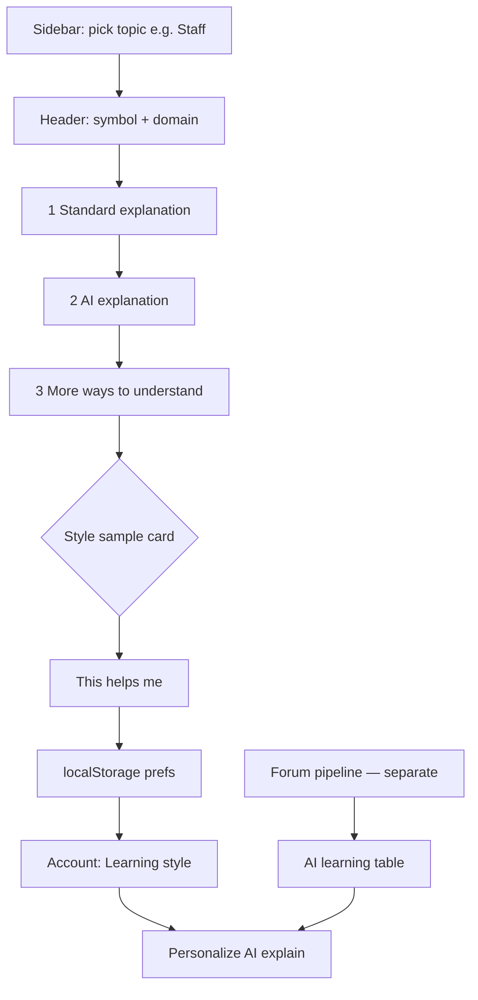

# ADR 005: Theory learning UI flow (prototype)

**Status:** Prototype in UI (perspective cards); server prefs + AI personalization live — see [ADR 006](./006-theory-learning-data-model.md). Forum → AI learning table is a **separate** backend feature — see [ADR 008](./008-forum-ai-learning-pipeline.md).

## User journey

## Screen layout (top → bottom)

| Block | Source (target) | Prototype today |
|-------|-----------------|-----------------|
| Standard explanation | `notation_definitions` | Live API |
| AI explanation | OpenAI + user prefs + category guidance + optional learning-table slices | Live API; prefs from account or localStorage |
| More ways to understand | Shuffled **style sample cards** (mock) | Live UI; not Forum insights |
| This helps me | `user_learning_categories` | Server when logged in; localStorage for guests |
| Account → Learning style | Same prefs | Server PATCH + local mirror |

## “More ways to understand” (style discovery)

Purpose: let learners **try different learning styles** before committing a preference.

- Cards are **prototype samples** from `getMockPerspectives()` / `getShuffledMockPerspectives()` — not approved Forum rows.
- Order is **shuffled** per topic visit.
- **“This helps me”** saves the card’s `categoryId` as the user’s learning style (server when logged in; localStorage for guests).
- Does **not** display `explanation_category_insights` (AI learning table). That table is backend-only for AI prompt injection.

## Where to preview

1. `/theory/notation-reading` → select **Staff** (richest mock perspectives)
2. `/theory/pitch-scales-keys` → **Sharp** or **Key Signature** (visual / chords thread sample)
3. `/account` → **Learning style** section

## Not in prototype

- On-demand AI-generated style samples (mock only today)
- AI response caching
- Harmony / Chords as first-class Theory items (copy references them only)

## Files

- `music-talks/app/components/theory/TheoryLearningPanel.tsx`
- `music-talks/app/theory/theoryLearningFlow.ts`
- `music-talks/app/components/account/TheoryLearningPreferences.tsx`
